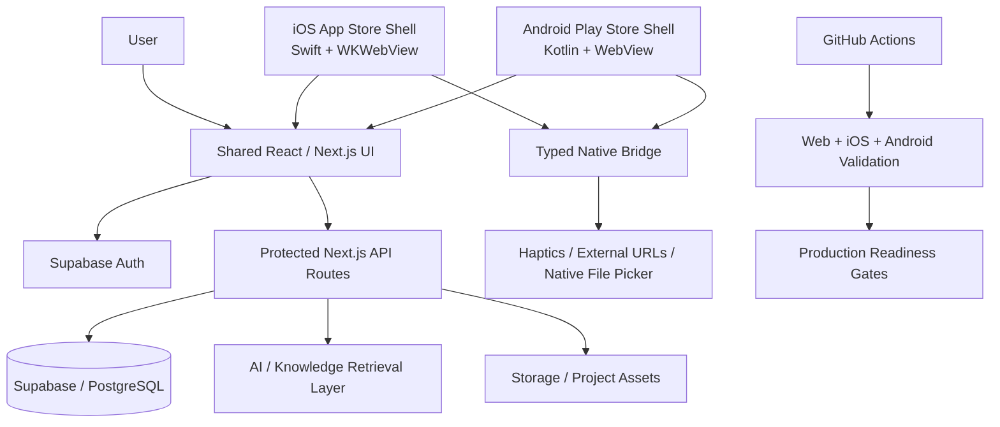

# Howlsy Architecture Overview

This document is a public, sanitized view of the engineering architecture behind **Howlsy**, a private AI-guided project platform. It intentionally excludes proprietary implementation details, secrets, credentials, private datasets, and production URLs.

## System shape

## Architectural evolution

Howlsy deliberately went through two mobile phases.

### Phase 1 — Native prototypes

Native clients were first implemented in **SwiftUI** and **Jetpack Compose** to validate the mobile boundary before the final visual system was locked.

Those prototypes proved:

- native authentication/session handling
- bearer-token access to protected backend routes
- streaming project generation
- cloud project libraries and detail views
- guided project progression
- simulator/emulator automation
- platform packaging and store-oriented constraints

The iOS prototype was merged through PR #90 and included an iOS 16 SwiftUI app, Supabase sessions, authenticated API access, streamed NDJSON progress, cloud project views, and simulator CI.

The Android prototype was merged through PR #91 and included Kotlin/Compose flows, encrypted refresh-token storage, guided-mode persistence, CI compilation, and hosted emulator coverage.

### Phase 2 — Shared presentation + native shells

After the product behavior and platform boundaries were validated, the production mobile direction moved to a **shared React/TypeScript/CSS presentation layer** inside minimal native store shells.

The goals were to:

- eliminate three separate visual implementations
- keep authentication/session ownership in one application layer
- preserve real native App Store / Play Store packages
- keep Swift and Kotlin focused on operating-system responsibilities
- retain native capabilities through a narrow bridge rather than duplicated screens

## Web application responsibilities

The shared web application owns the visible product experience and most application state.

Key responsibilities include:

- authentication and account flows
- project creation and generation
- project library and project details
- guided project execution
- shared navigation and design system
- server/API interaction
- subscription entitlement reads
- failure and retry presentation

The UI stack centers on **React, Next.js, TypeScript, CSS Modules, and shared global design tokens**.

## Native iOS boundary

The production iOS wrapper is intentionally small.

Responsibilities include:

- `WKWebView` hosting
- persistent first-party web session storage
- safe-area integration
- same-origin native bridge handling
- native haptics
- approved external URL handling
- release-only HTTPS enforcement
- debug-only Web Inspector access
- native-shell failure handling

Bridge messages are restricted to the configured first-party origin and main frame.

## Native Android boundary

The Android production wrapper follows the same principle.

Responsibilities include:

- Android `WebView` hosting
- persistent first-party cookies
- third-party cookie rejection
- origin-scoped native messaging with AndroidX WebKit
- native document picker integration for file uploads
- haptics and approved external URL handling
- production HTTPS enforcement
- debug-only WebView debugging
- graceful connection / HTTP 5xx fallback behavior

## Authentication and API security

Protected AI-backed routes do not accept anonymous requests.

The backend supports authenticated sessions and validates the live user before protected operations. Earlier native prototypes used bearer-token access; the shared production presentation now centralizes session ownership in the web application.

Security goals include:

- no service-role credentials in mobile clients
- no OpenAI/private provider secrets in mobile clients
- early 401 rejection for invalid sessions
- user-scoped database access
- RLS-backed user data isolation
- server-owned authorization for paid entitlements

## Billing and entitlement direction

The entitlement foundation is designed so a client cannot grant itself paid access.

The public architectural principles are:

- entitlement records are server-owned
- authenticated users may read only their own entitlement state
- client insert/update/delete rights are revoked
- privileged reads remain user-scoped
- only valid states such as active or grace-period access are accepted
- provider transaction identifiers are not exposed unnecessarily

StoreKit 2 client work and the server entitlement foundation are separate layers so purchase UX is not treated as the source of truth for server authorization.

## Knowledge and AI layer

Howlsy is designed around more than direct text generation. The product architecture includes structured knowledge retrieval, provenance controls, model/manufacturer exactness, and validation gates.

Engineering themes include:

- database-first retrieval
- structured source provenance
- exact-model protections
- deterministic regression checks
- resumable ingestion/acquisition workflows
- separation of reviewed facts from unverified assets
- controlled publication paths

## Validation strategy

The project uses multiple validation layers rather than relying on a single build command.

### Web

- TypeScript validation
- route/security regressions
- application behavior checks
- production-readiness scripts

### iOS

- Xcode build validation
- simulator smoke coverage
- shared CSS rendering checks
- native bridge checks
- failure-state checks

### Android

- Gradle build validation
- hosted emulator coverage
- native bridge checks
- file-picker contract checks
- failure-state checks

### Readiness gates

Repository scripts verify architecture-level invariants such as:

- protected API registration
- single session ownership
- mobile-shell configuration
- origin isolation
- debugging restrictions
- account-security requirements
- billing entitlement restrictions
- graceful mobile failure behavior

## Design principle

The architecture follows a simple rule:

> **Share product logic and presentation where consistency matters; keep native code where the operating system matters.**

That allows the project to retain real native packaging and native capabilities while avoiding unnecessary duplication across web, iOS, and Android.

---

[Back to Howlsy case study](./HOWLSY_CASE_STUDY.md) · [Back to profile](./README.md)
